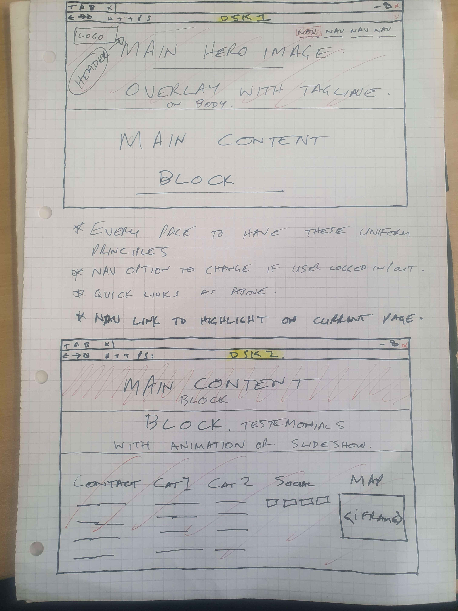
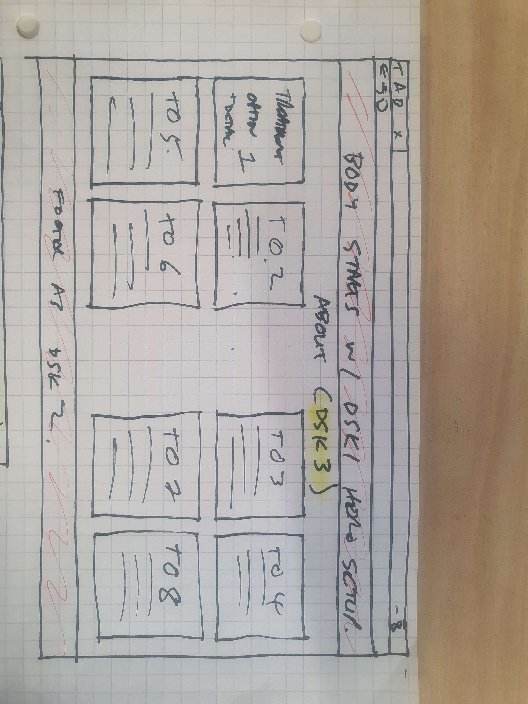
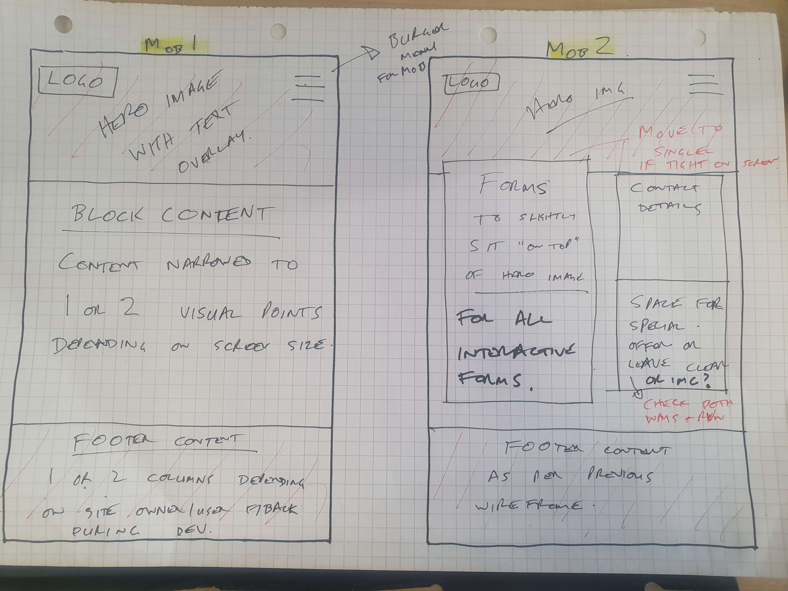
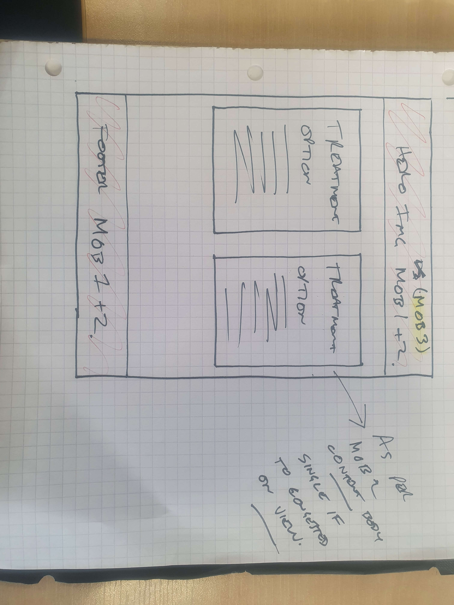

# JA Therapies
## Background
JA therapies is the brainchild of S. Noor and J.Anand who was formed from a dream to offer holistic treaments to all that are rooted in recognised healthcare principles. They would like to have a professional looking website that exibits their level of expertise and professionalism.

As the team is quite small and all have their own specialisms they require a website with a level of automation that would suit their needs. They would need and automated way for customers to make provisional bookings and a function for user to ba able to contact the business at their leisure in order for the relevant treatment specialist to be able to respond further reinforcing the specialist fields catered for by the business and promoting trust in the business and people itself.

The aim is to build a website where only registered users may access the booking and messaging functions but where unregistered user may have enough information in order to be able to make an informed decision as to whether they would like to register or not as well as reducing the possibility of staff time being wasted by spoof contact requests and bookings.

## User Experience
### Site Owner Goals
* Make it easy for customer to make an appointment.
* Be able to confirm appointments.
* Be able to cancel appointments.
* Be able to amend an appointment details.
* Be able to access customer details.
* Allow customers to see the services on offer with prices.
* Be able to recieve a message from customers through a message form when logged in.
* Be able to recieve a booking from a customer through a booking form when logged in.
* Allow customers to know where the clinic is located.

### Site User Goals
* I will know where the JA Therapy clinic is located.
* I will know what kind of services the practice offers.
* I want to be able to book an appointment.
* I will be able to find out about the company and the level of skill of staff.
* I will be able to message the company with a contact request.
<!-- * I want to get a confirmation email with my appointment time. -->
* I want to be able to view, amend or delete an appointment.

### Planning
* The project was planned using Github's project planning function. 
<!-- INSERT PICTURE OR LINK WHEN COMPLETED -->

## Wireframe
* The basic wireframe design was put together with the client with a few preference as to how the site was visualised and on discussion it was possible to identify a few points to work towards with an element of flexibility around vsualsto be reviewed at the end of every sprint. 

### Desktop



### Mobile



The points pulled from the wireframes were:
* Every page to have a "hero" image with text overlay.
* The menu and logo would fit convention standards with a "burger" menu for smaller screen sizes.
* Quick link options at the bottom of each page with a Google maps link.

* Once these were defined it was a case of finding a few free bootstrap templates for the client to select from which was then customised to fit the requirements of the client and was primarily on the allauth template pages and booking/contact form pages which were designed and customised to fit the aesthetic of the selected template both in HTML design and CSS styling. There was one piece of JavaScript code that was written specifically for the UX on the Nabvbar which is discussed in the development summary below.

* The 2 designs that closest fit the clients requirements were:
Yogalax

Physical Therapy


## Design
* The design was chosen by the business owner from a free template (called physical therapy) available on [Colorlib] (https://colorlib.com/wp/templates/). As the website is not currently being hosted the license for the template has not been purchased hence copyright information is still visible on the page until proof of concept is approved by the site owner. On approval this will continue to be a working project and will be cloned into a new respository.

### Fonts
* The fonts as per the template are "Rubik", "Segoe UI", Roboto, "Helvetica Neue", Arial, sans-serif. Fonts would remain relatively consistent in the event the site is viewed on different devices with the fonts of Roboto, Arial & sans-serif being available on all devices and the typefaces of "Rubik", "Segoe UI" & "Helvetica Neue" being referred to as typefaces as they include all the glyphs used to display a character such as the "J" in the main title.
### Colours
* The font was chosen by the site owner due to its clean contrast between colour combinations which were simple & warm conveying the relaxing enviroment of the clinic itself. It will allow for the official trademarked branding to be added at a later date as well as copyrighted photographs whilst remaining aesthitically pleasing. This was tested as part of the template selection process however for this project stock images have been used to not infringe on copyright.

The contrast checking on the website showed 7 failed colour contrast pairs although this was an automated check and the checking site states "Automatic programs such as this cannot analyze text embedded in images and may misdiagnose or ignore certain critical issues. We recommend that you combine contrast testing results from this website with a manual test performed by a trained accessibility expert." With this in mind it is important to note that all issues raised were related to text within images so a recommendation would be to perform an accessibility analysis by a trained professional to ensure and prove digital compliance before the JA Therapies site is hosted in the public domain. [Bureau of Internet Accessibility](https://www.boia.org/)

However slightly adjusting the colour contrast allowed the test to pass:
*Before:

*After:


## Technologies
### Languages
* [HTML](https://www.w3schools.com/html/)
* [CSS](https://www.w3schools.com/css/)
* [JavaScript](https://www.w3schools.com/js/)
* [Python](https://www.python.org/)

### Tools & Frameworks
* [GitHub](https://github.com/)
* [Gitpod](https://www.gitpod.io/)
* [Django](https://www.djangoproject.com/)
* [Heroku](https://www.heroku.com/home)
* [Postgres](https://www.postgresql.org/)
* [Google Fonts](https://fonts.google.com/)
* [W3C HTML Validation](https://validator.w3.org/)
* [H3C CSS Validation](https://jigsaw.w3.org/css-validator/validator.html.en)
* [http://pep8online.com/](http://pep8online.com/)
* [a11y](https://color.a11y.com/Contrast/)
* [TinyPNG](https://tinypng.com/)

## Features
### Navigation
* The navigation bar was designed as a full size menu right aligned as per convention for the desktop version although the menu did not show which page the user was on reulting in poor UX. To address this the handleActivNavLink.js file was written so that an "addClass" would be added to the navlink of the viewed page allowing for the corresponsing CSS to take effect.
* As per the clients request the menu was a "burger" menu on smaller devices and a concious decision was made by the client to not utilise a collapsible menu on the site to not have the site seem to "busy".

### Home

### About

### Contact
* This is a page that was set to only be viewed when the user is logged in and was set using the allauth decorator of "login_required" in the views.py file to ensure that it coulds not be accessed by writing the url directly in the address bar.

<!-- FINISH THIS -->

### Booking
* This is a page that was set to only be viewed when the user is logged in and was set using the allauth decorator of "login_required" in the views.py file to ensure that it coulds not be accessed by writing the url directly in the address bar.
<!-- FINISH THIS -->
## Code validation & Testing
### Testing
* The TestCase module imported from Django.test was used to test 

### HTML
<!-- CODE TEST RESULT TO GO HERE -->
### CSS
<!-- CODE TEST RESULT TO GO HERE -->
### JavaScript
<!-- CODE TEST RESULT TO GO HERE -->
### Python
<!-- CODE TEST RESULT TO GO HERE -->
## Rendering on different screen sizes
### Desktop

### Mobile

## Deployment & setting up Postgres DB
* On the home screen click on create new app
* Enter project name & select region
* Under resources add database to the app resources by selecting Herku Postgres and adding it to env.py in the follwing steps
* Select settings and go to config vars and then reveal config vars
* Set the secret key and database url in heroku config vars and env.py and finalise the connection in settings to ensure sensitive data is not visible in the settings.py file
* Deploy to Heroku by selecting Github as the method and connecting vis the prompt
* Click into the search box tyoe project name and then connect
* Click deploy branch.
* Once complete the view button will allow the app to be shown in a browser

The program is set to be deployed automatically after each push from gitpod.

### Credits
##


Welcome moshabbir-dotcom,

This is the Code Institute student template for Gitpod. We have preinstalled all of the tools you need to get started. It's perfectly ok to use this template as the basis for your project submissions.

You can safely delete this README.md file, or change it for your own project. Please do read it at least once, though! It contains some important information about Gitpod and the extensions we use. Some of this information has been updated since the video content was created. The last update to this file was: **September 1, 2021**

## Gitpod Reminders

To run a frontend (HTML, CSS, Javascript only) application in Gitpod, in the terminal, type:

`python3 -m http.server`

A blue button should appear to click: _Make Public_,

Another blue button should appear to click: _Open Browser_.

To run a backend Python file, type `python3 app.py`, if your Python file is named `app.py` of course.

A blue button should appear to click: _Make Public_,

Another blue button should appear to click: _Open Browser_.

In Gitpod you have superuser security privileges by default. Therefore you do not need to use the `sudo` (superuser do) command in the bash terminal in any of the lessons.

To log into the Heroku toolbelt CLI:

1. Log in to your Heroku account and go to *Account Settings* in the menu under your avatar.
2. Scroll down to the *API Key* and click *Reveal*
3. Copy the key
4. In Gitpod, from the terminal, run `heroku_config`
5. Paste in your API key when asked

You can now use the `heroku` CLI program - try running `heroku apps` to confirm it works. This API key is unique and private to you so do not share it. If you accidentally make it public then you can create a new one with _Regenerate API Key_.

------

## Release History

We continually tweak and adjust this template to help give you the best experience. Here is the version history:

**September 1 2021:** Remove `PGHOSTADDR` environment variable.

**July 19 2021:** Remove `font_fix` script now that the terminal font issue is fixed.

**July 2 2021:** Remove extensions that are not available in Open VSX.

**June 30 2021:** Combined the P4 and P5 templates into one file, added the uptime script. See the FAQ at the end of this file.

**June 10 2021:** Added: `font_fix` script and alias to fix the Terminal font issue

**May 10 2021:** Added `heroku_config` script to allow Heroku API key to be stored as an environment variable.

**April 7 2021:** Upgraded the template for VS Code instead of Theia.

**October 21 2020:** Versions of the HTMLHint, Prettier, Bootstrap4 CDN and Auto Close extensions updated. The Python extension needs to stay the same version for now.

**October 08 2020:** Additional large Gitpod files (`core.mongo*` and `core.python*`) are now hidden in the Explorer, and have been added to the `.gitignore` by default.

**September 22 2020:** Gitpod occasionally creates large `core.Microsoft` files. These are now hidden in the Explorer. A `.gitignore` file has been created to make sure these files will not be committed, along with other common files.

**April 16 2020:** The template now automatically installs MySQL instead of relying on the Gitpod MySQL image. The message about a Python linter not being installed has been dealt with, and the set-up files are now hidden in the Gitpod file explorer.

**April 13 2020:** Added the _Prettier_ code beautifier extension instead of the code formatter built-in to Gitpod.

**February 2020:** The initialisation files now _do not_ auto-delete. They will remain in your project. You can safely ignore them. They just make sure that your workspace is configured correctly each time you open it. It will also prevent the Gitpod configuration popup from appearing.

**December 2019:** Added Eventyret's Bootstrap 4 extension. Type `!bscdn` in a HTML file to add the Bootstrap boilerplate. Check out the <a href="https://github.com/Eventyret/vscode-bcdn" target="_blank">README.md file at the official repo</a> for more options.

------

## FAQ about the uptime script

**Why have you added this script?**

It will help us to calculate how many running workspaces there are at any one time, which greatly helps us with cost and capacity planning. It will help us decide on the future direction of our cloud-based IDE strategy.

**How will this affect me?**

For everyday usage of Gitpod, it doesn’t have any effect at all. The script only captures the following data:

- An ID that is randomly generated each time the workspace is started.
- The current date and time
- The workspace status of “started” or “running”, which is sent every 5 minutes.

It is not possible for us or anyone else to trace the random ID back to an individual, and no personal data is being captured. It will not slow down the workspace or affect your work.

**So….?**

We want to tell you this so that we are being completely transparent about the data we collect and what we do with it.

**Can I opt out?**

Yes, you can. Since no personally identifiable information is being captured, we'd appreciate it if you let the script run; however if you are unhappy with the idea, simply run the following commands from the terminal window after creating the workspace, and this will remove the uptime script:

```
pkill uptime.sh
rm .vscode/uptime.sh
```

**Anything more?**

Yes! We'd strongly encourage you to look at the source code of the `uptime.sh` file so that you know what it's doing. As future software developers, it will be great practice to see how these shell scripts work.

---

Happy coding!


https://www.delftstack.com/howto/django/django-phone-number-field/

